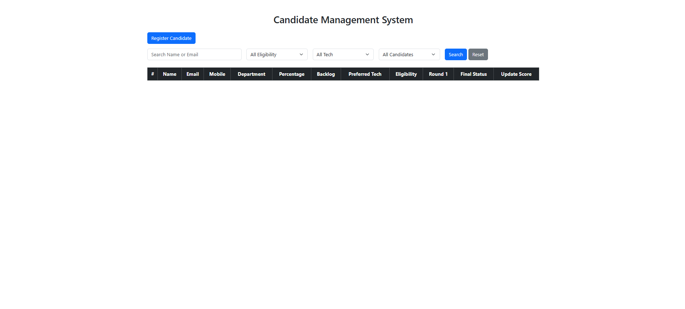
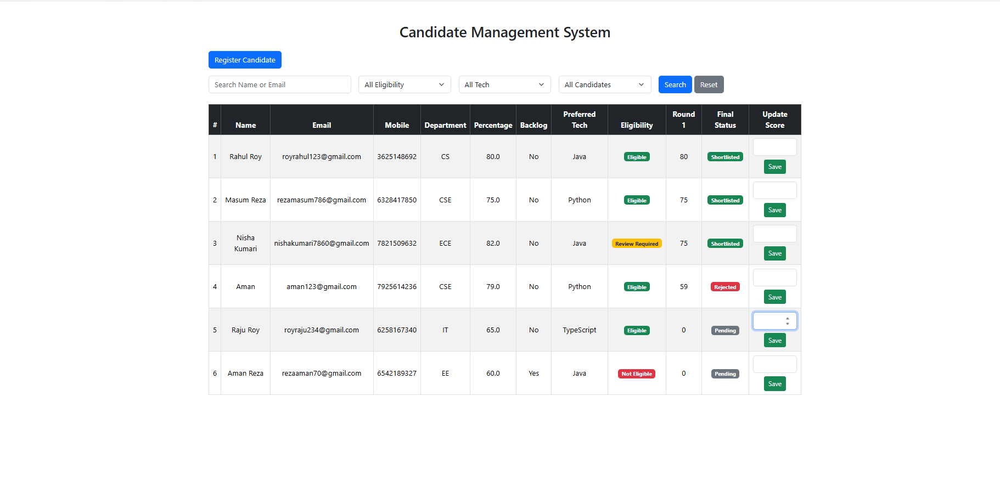
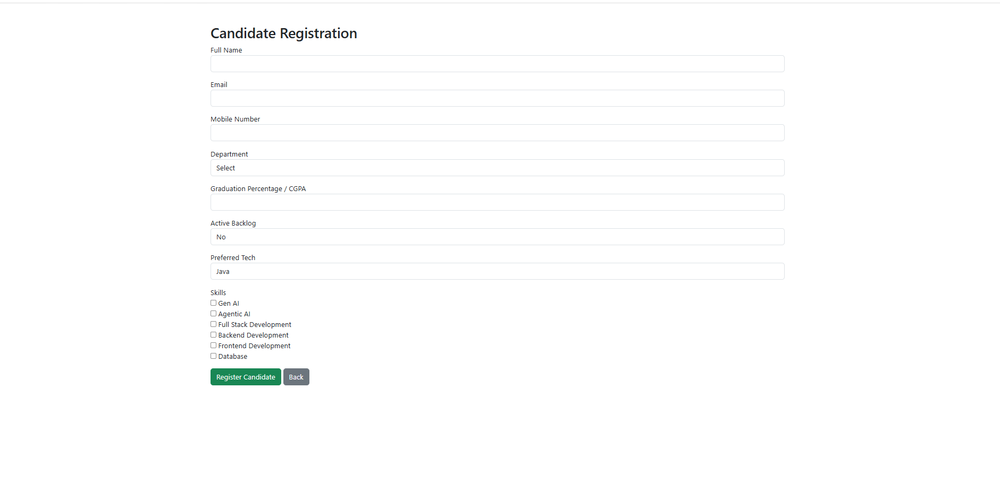
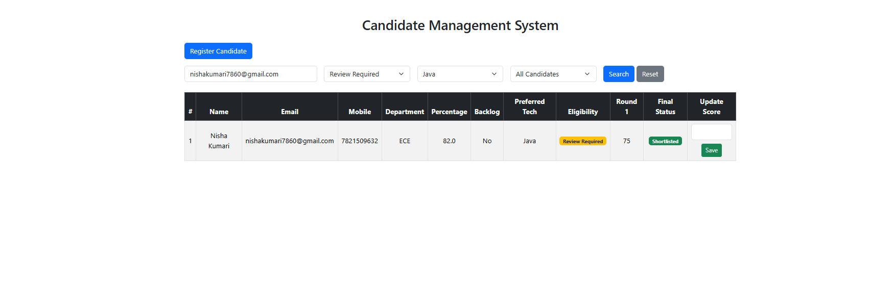
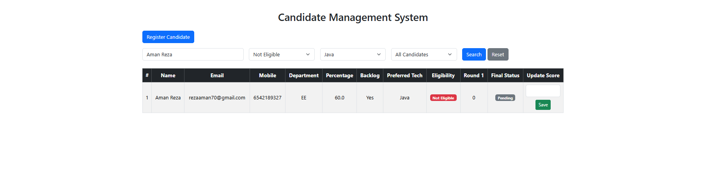
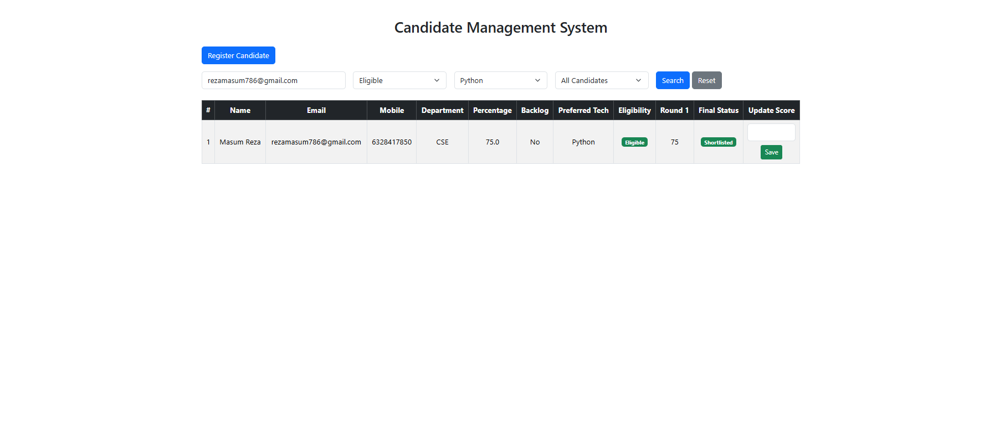

# Candidate Management System

A Flask-based Candidate Management System developed as part of a technical interview assignment.

This application helps recruiters register candidates, automatically determine eligibility, evaluate Round 1 performance, shortlist candidates, and search/filter records efficiently.

---

## Features

- Candidate Registration
- Input Validation
- Duplicate Email & Mobile Validation
- Eligibility Engine
- Round 1 Score Evaluation
- Automatic Shortlisting
- Search by Name or Email
- Filter by Eligibility
- Filter by Preferred Tech Stack
- Show Only Shortlisted Candidates
- SQLite Database Integration
- Responsive Bootstrap UI

---

## Tech Stack

- Python
- Flask
- SQLite3
- HTML5
- Bootstrap
- Jinja2

---

## Project Structure

```
Candidate_Management_System/
│
├── app.py
├── database.py
├── models.py
├── requirements.txt
├── README.md
│
├── templates/
│   ├── index.html
│   └── register.html
│
├── static/
│   └── style.css
│
└── screenshots/
    ├── dashboard1.png
    ├── dashboard2.png
    ├── candidate_registration.png
    ├── search.png
    ├── filter.png
    └── shortlist.png
```

---

## Application Screenshots

### Dashboard

Shows all registered candidates with eligibility status, Round 1 score, and final shortlist status.



---

### Dashboard (Updated Records)

Displays multiple candidates after evaluation and sorting.



---

### Candidate Registration

Register a new candidate with validation and duplicate checking.



---

### Search Candidate

Search candidates using Name or Email.



---

### Filter Candidates

Filter candidates by:

- Eligibility Status
- Preferred Tech Stack
- Shortlisted Candidates



---

### Shortlisted Candidates

Shows only shortlisted candidates after Round 1 evaluation.



---

## Business Rules

### Eligible

- No Active Backlog
- Percentage ≥ 60%
- Department = CS / CSE / IT

### Review Required

- No Active Backlog
- Percentage ≥ 60%
- Department other than CS/CSE/IT

### Not Eligible

- Active Backlog
- Percentage < 60%

---

## Installation

```bash
git clone https://github.com/MdAbuBakar209/candidate-management-system.git
```

```bash
cd candidate-management-system
```

```bash
pip install -r requirements.txt
```

```bash
python app.py
```

---

## Author

**Md Abu Bakar**

GitHub:
https://github.com/MdAbuBakar209
